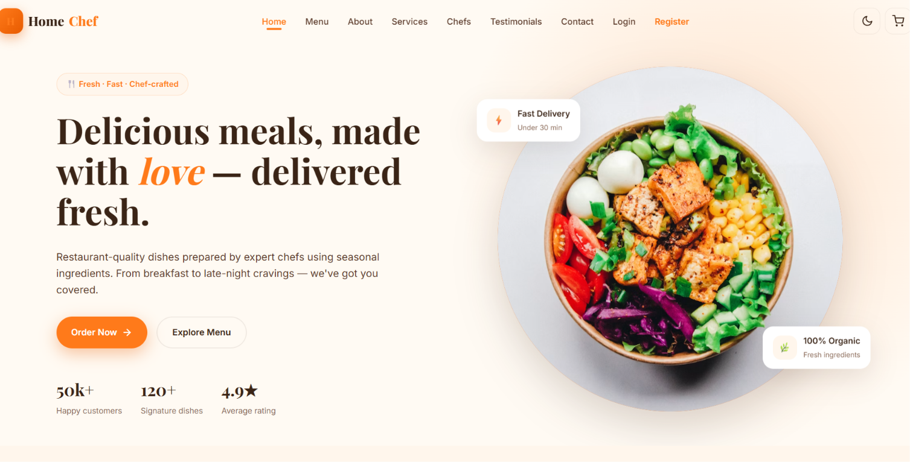

# 🍽️ HomeChef - Responsive Food Ordering Website

A modern and responsive food ordering website built using **HTML**, **CSS**, and **JavaScript** that connects users with home chefs.

## 📷 Homepage Preview



---

## ✨ Features

- 🍽️ Browse delicious homemade meals
- 👨‍🍳 Explore professional chef profiles
- 🛒 Add food to cart
- 🔐 Login & Register
- 📱 Fully Responsive Design
- 📞 Contact Page

---

## 🛠️ Technologies Used

- HTML5
- CSS3
- JavaScript

---

## 📂 Folder Structure

```text
HomeChef/
│
├── css/
├── js/
├── Images/
├── index.html
├── about.html
├── menu.html
├── services.html
├── chefs.html
├── contact.html
├── login.html
├── register.html
└── cart.html
```

---

## 🚀 How to Run

1. Clone the repository

```bash
git clone https://github.com/SreenaKannan/HomeChef.git
```

2. Open `index.html` in your browser.

---

## 👩‍💻 Developer

**Sreena Kannan**

Final-Year Computer Science and Business Systems Student

Java Full Stack Developer
